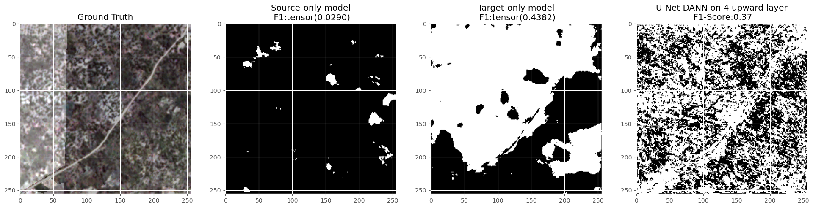

In a nutshell, DA makes it possible to apply one model that has been trained in one source domain (dataset) to a target domain (dataset) that has a different data distribution than the source domain and that may have less or may not have any labels for training. The study area of my thesis will be Ivory Coast, which will be considered the source domain, and Tanzania, that will be the target domain.

In my MSc thesis, I will be implementing domain adaptation techniques to semantic segmentation models for cashew crop mapping in Africa to assess their potential for increasing the generalization capabilities of the models. More sepecifically, I will work with an adapted U-Net following the main ideas of the Domain Adversarial Neural Network (DANN) proposed by Ganin et al. (2015). 

**Initial results**

Some initial results are shown on the figure below. Numerically the implementation of the DANN network is improving the accuracy, however when the actual segmentation is evaluated, it is evident that the models need to improve. 

If you have any suggestions on how to improve the models, feel free to hit me up with an e-mail :).

