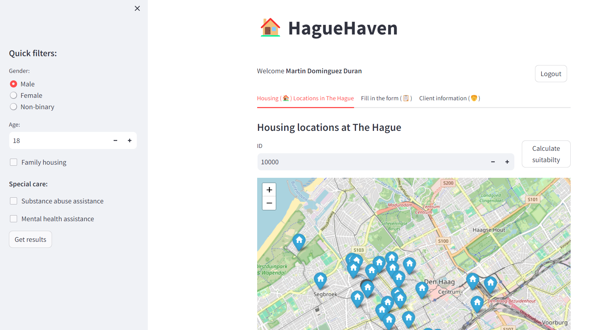

How can we help municipality workers and housing organizations in The Hague (**Municipality of The Hague**) to allocate shelter seekers in better matching locations by enabling them to work efficiently within a shared overview?

This was the challenge that our team (Petra Bardócz, Annemieke Verhoek, Alejandro Salgueiro Dorado and I) decided to tackle during the 6th edition of **Hackathon For Good**. 

Our solution focused on creating a centralized environment where all three parties (municipality social workers, housing organizations and shelter seeker) can participate in the process, take relevant actions, and update the offer and demand in a near real-time fashion. With our application we ended up winning the challenge and were also awarded the **WorldStartup** bonus prize for the most promising business opportunity with clear and realistic roadmap! 

It was a great learning experience and an amazing 48 hour of hacking with an awesome team. 

